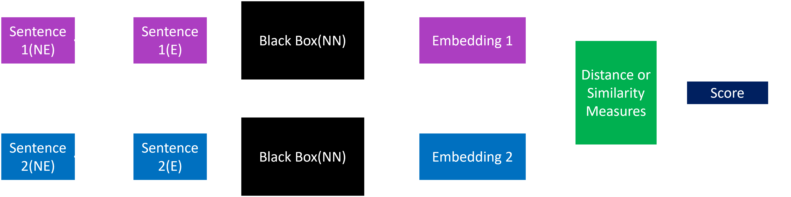
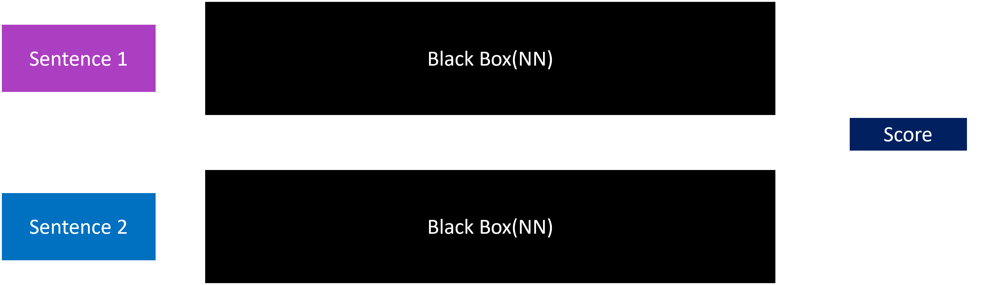
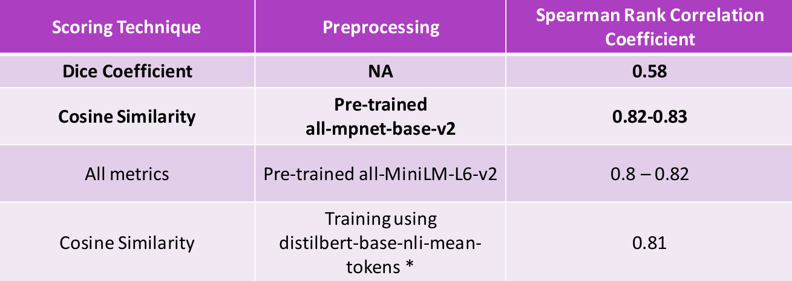

# CS779A Group 3 Project

## Semantic Textual Relatedness for African and Asian Languages

### Introduction

The semantic relatedness of two language units has long been considered fundamental to understanding meaning (Halliday and Hassan 1976, Miller and Charles 1991), and automatically determining relatedness has many applications such as evaluating sentence representation methods, question answering, and summarization (Abdalla et al. 2023).

Two sentences are considered semantically similar when they have a paraphrasal or entailment relation. On the other hand, relatedness is a much broader concept that accounts for all the commonalities between two sentences: whether they are on the same topic, express the same view, originate from the same time period, one elaborates on (or follows from) the other, etc. 

Consider the two sentences:

| Pair | Sentence 1                               | Sentence 2                                               | 
|------|------------------------------------------|----------------------------------------------------------|
| 1    | There was a lemon tree next to the house | The boy liked playing football next under the lemon tree |
| 2    | There was a lemon tree next to the house | The boy liked playing football                           |

As for __Relatedness__, sentence pair 1 seems to be more related than pair 2.

### Objective

The main aim of this problem statement is to design a system for efficient calculation of relatedness score between two sentences in a pair. The relatedness should be measured in terms of a score in the range of `0` (representing completely **unrelated**) and `1` (representing completely **related**). The entire problem statement has been divided into three stages:

- **Track A - Supervised**

Developing a relatedness calculation system by training on labelled data provided in 14 different languages to ensure diversity. This involves training a language model on the existing labelled data provided in their __repository__ and other data sources. 

- **Track B - Unsupervised**

Developing the same relatedness system but without access to any labelled data since **semantic relatedness** calculation manually is a tedious task. This essentially requires creation of unigram or bigrams from various languages. The approach decided as of now is mentioned in the above flowchart.

- **Track C - Cross Lingual**

Developing relatedness systems for the case of lacking target language data and with the use of labeled dataset(s) from at least one other language. The applications of this lies in enhancing *machine translation* and for analyzing *low-resource languages* especially like **Kinyarwanda**.

## Our Approach

> First Approach

Our approach to the relatedness problem includes two parts mainly, first without the use of **Transformers** which leverages use of good metrics like **Dice Coefficient**, **Jaccard Similarity** (Mainly based on `lexical overlap`), **Cosine Similarity**, **Normalized Google Distance** etc. on the cleverly preprocessed tokens generated from the sentences in each pair for scoring. 

> Second Approach

This mainly involves using some state of the art transformer models for sentences tokenization like **sBERT**, **Universal Sentence Encoder**, or other transfer learning methods for creating sentence embeddings and **distance-based** metrics or a **feed-forward**
network can be used for the scoring part otherwise the entire concept can be extended to directly score the embeddings via a **Siamese architecture**. Care also needs to be take for the multingual part which can either be tackled using **multilingual models** or designing an efficient **translation system** for low-resource languages.

1. Using either pretrained or finetuned BERT based embeddings

2. End to End scoring:

## Evaluation

Evaluations for all the three tasks are done on the basis of **Spearman Rank Correlation**

## Some Results

These are some of the correlations obtained on some SOTA models and scoring metrics. Our current task essentially focuses on improving the score over the baseline **0.83**.

## Project based resources

- [Intro PPT](https://github.com/Rajarshi1001/CS779AProject/blob/master/CS779A_theBoys.pdf)
- [Mid Term Presentation]([CS779_theBoys_MidTerm.pdf](https://github.com/Rajarshi1001/CS779AProject/blob/master/CS779_theBoys_MidTerm.pdf))
- [Mid Term Project Report]()
- [Project Doc link](https://docs.google.com/document/d/1Real5lpdL3gTRXVUCN71ZB56jWot9Q2bcvxHIIhXDeo/edit)
- [Problem Statement link](https://semantic-textual-relatedness.github.io/)  

__Group Name__: __The BOYS__
__Group Number__: 3

|Members | Github-ID |
| --- | --- |
| Rajarshi Dutta | [@Rajarshi1001](https://github.com/Rajarshi1001) |
| Shivam Pandey | [@shivamp-20](https://github.com/shivamp-20)|
| Udvas Basak | [@IonUdvas](https://github.com/IonUdvas)|

### References

1. Al Sulaiman, M., Moussa, A. M., Abdou, S., Elgibreen, H., Faisal, M., & Rashwan, M. (2022). Semantic textual similarity for modern standard and dialectal Arabic using transfer learning. PLOS ONE, 17(8), e0272991. [https://doi.org/10.1371/journal.pone.0272991](https://doi.org/10.1371/journal.pone.0272991)

2. Cilibrasi, R. L., & Vitanyi, P. M. B. (2007). The google similarity distance. IEEE Transactions on Knowledge and Data Engineering, 19(3), 370–383. [https://doi.org/10.1109/TKDE.2007.48](https://doi.org/10.1109/TKDE.2007.48) 

3. Reimers, N., & Gurevych, I. (2020). Making monolingual sentence embeddings multilingual using knowledge distillation. Proceedings of the 2020 Conference on Empirical Methods in Natural Language Processing (EMNLP), 4512–4525. [https://doi.org/10.18653/v1/2020.emnlp-main.365](https://doi.org/10.18653/v1/2020.emnlp-main.365)

4. Abdalla, M., Vishnubhotla, K., & Mohammad, S. (2023). What makes sentences semantically related? A textual relatedness dataset and empirical study. Proceedings of the 17th Conference of the European Chapter of the Association for Computational Linguistics, 782–796. [https://doi.org/10.18653/v1/2023.eacl-main.55](https://doi.org/10.18653/v1/2023.eacl-main.55)

 
