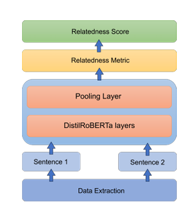
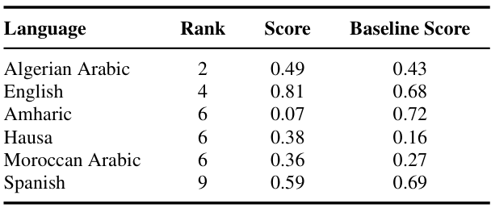

    <h1>SemEval 2024 Task 1: Semantic Textual Relatedness for African and Asian Languages
    </h1>
    <a href="url">View Paper</a> 
    |
    <a href = "https://github.com/Rajarshi1001/IITK-SemEval-2024-Task-1/issues"> Raise an Issue</a>
    |
    <a href = "https://github.com/Rajarshi1001/IITK-SemEval-2024-Task-1/pulls"> Submit Pull Request</a>

## Introduction

The semantic relatedness of two language units has long been considered fundamental to understanding meaning (Halliday and Hassan 1976, Miller and Charles 1991), and automatically determining relatedness has many applications such as evaluating sentence representation methods, question answering, and summarization (Abdalla et al. 2023).

Two sentences are considered semantically similar when they have a paraphrasal or entailment relation. On the other hand, relatedness is a much broader concept that accounts for all the commonalities between two sentences: whether they are on the same topic, express the same view, originate from the same time period, one elaborates on (or follows from) the other, etc. 

Consider the two sentences:

| Pair | Sentence 1                               | Sentence 2                                               | 
|------|------------------------------------------|----------------------------------------------------------|
| 1    | There was a lemon tree next to the house | The boy liked playing football next under the lemon tree |
| 2    | There was a lemon tree next to the house | The boy liked playing football                           |

As for __Relatedness__, sentence pair 1 seems to be more related than pair 2.

## Objective

The main aim of this problem statement is to design a system for efficient calculation of relatedness score between two sentences in a pair. The relatedness should be measured in terms of a score in the range of `0` (representing completely **unrelated**) and `1` (representing completely **related**). The entire problem statement has been divided into three stages:

- **Track A - Supervised**

Developing a relatedness calculation system by training on labelled data provided in 14 different languages to ensure diversity. This involves training a language model on the existing labelled data provided in their __repository__ and other data sources. 

- **Track B - Unsupervised**

Developing the same relatedness system but without access to any labelled data since **semantic relatedness** calculation manually is a tedious task. This essentially requires creation of unigram or bigrams from various languages. The approach decided as of now is mentioned in the above flowchart.

- **Track C - Cross Lingual**

Developing relatedness systems for the case of lacking target language data and with the use of labeled dataset(s) from at least one other language. The applications of this lies in enhancing *machine translation* and for analyzing *low-resource languages* especially like **Kinyarwanda**.

## Our Approach

> Supervised Track

- __Baseline Approach__ : The baseline models, `Jaccard Coefficient`, `Dice Coefficient`, and similar coefficients after removing stopwords were calculated to arrive at reliable baseline metrics to build upon.

- __Multingual BERT__ : An attempt was made to train multilingual BERT: mBERT, by extending the vocabulary to allocate the tokens of various low-resource languages like Amharic, Hausa, Algerian Arabic, Afrikaans, Indonesian etc. The approach included genera
tion of the vocabulary of each of the languages from the training data and then calling the pre-trained mBERT model and tokenizer. The trained tokenizer was extended to include the new tokens generated from the vocab of the corresponding low resource languages. A trainable feed-forward network was added with the corresponding dropout. The loss metric used was mean squared error loss on both the training validation data and the Spear
man rank correlation were calculated at the end of each validation epoch.

- __Contrastive Learning__ :  This approach uses the `SIMCSE` model which essentially aligns related sentences close in the embedding space and maximizes distances to unrelated sentences in each batch of data. For a supervised setting, it classifies positive samples as entailment pairs, while negative samples are derived from contradiction pairs. The training scheme proceeds via minimizing the constrasticve loss function.

  

- __Combined Relatedness Metric__ : A simple supervised deterministic regression model can be implemented to combine these metrics. Furthermore, to explore the importance of each of these metrics, a simple covariance matrix can show how the vector metrics onhigher element-wise-powered vectors hold information not caught directly at the lower powers of the vectors. To implement this supervised regression model, a simple 3-layered feed-forward neural network([25]+[50]+[25]) is trained. 

$$
x_i = { S(v_{i1}, v_{i2}), S(v_{i1}^{2}, v_{i2}^{2}), \ldots, 
S(v_{i1}^{10}, v_{i2}^{10}), J(v_{i1}, v_{i2}), D(v_{i1}, v_{i2})}
$$

where 
$$
v^{j} = (v_{1}^{j}, v_{2}^{j}, \ldots, v_{n}^{j})
$$

and

$$
S(a, b) = { C(a, b), E(a, b), M_{1}(a, b), M_{2}(a, b)}
$$

$$
C(a, b) = \text{Cosine Similarity between } a \text{ and } b
$$

$$
E(a, b) = \text{Euclidean Distance between } a \text{ and } b
$$

$$
M_{1}(a, b) = \text{Manhattan Distance between } a \text{ and } b
$$

$$
M_{2}(a, b) = \text{Mahalanobis Distance between } a \text{ and } b
$$

$$
J(a, b) = \text{Jaccard similarity between } a \text{ and } b
$$

$$
D(a, b) = \text{Dice similarity between } a \text{ and } b
$$

> Unsupervised Approach

- __Bigram Corpus creation and training__: We thought of an approach to generate bigrams dataset from any language corpus. A three element tuple was created within the same bigram to note how words were related in the _same sentence_, _same paragraph_ and _same document_. Our main objective was to use the co-occurrence frequencies to produce word-embeddings. We planned to enhance our method by applying __hierarchical clustering__,which helps identify word similarities and relationships. Moreover,we decided to use a 1:1 __negative sampling strategy__ to refine the embeddings further. The figure depiciting the workflow is given below:

- __TSDAE__: _Denoising autoencoders_ were used which had an encoder-decoder architecture. The `encoder` layer outputs a dense latent representation, capturing the essence of the data
 in high-dimensional space. The `decoder` aims to reconstruct the uncorrupted representation from the emebddings. The objective lies in minimizing the distance between the corrupted and reconstructed representation through the `cross-entropy loss`. 

> All the implementation can be found under the `kaggle_notebooks/` folder and the SIMCSE implementation under the `Track A\` folder. 

## Evaluation

Evaluations for all the three tasks are done on the basis of **Spearman Rank Correlation**

While running any of the kaggle notebooks, please download the Semantic_relatedness_dataset present in kaggle datasets. The link for the dataset is given [Dataset Link](https://www.kaggle.com/datasets/udvasbasak/semantic-textual-relatedness-data)

## Results

These are the results obtained through our system developed for the supervised track of the problem. 

  

These are the results obtained through our system developed for the unsupervised track of the problem. 

  

## Project based resources

- [Intro PPT](https://github.com/Rajarshi1001/IITK-SemEval-2024-Task-1/blob/master/project_resources/CS779A_theBoys_Intro_ppt.pdf)
- [Mid Term Presentation](https://github.com/Rajarshi1001/IITK-SemEval-2024-Task-1/blob/master/project_resources/CS779_theBoys_MidTerm_ppt.pdf)
- [Final Presentation](https://github.com/Rajarshi1001/IITK-SemEval-2024-Task-1/blob/master/project_resources/CS779-Project-Final-Presentation-3.pdf)
- [Mid Term Project Report](https://github.com/Rajarshi1001/IITK-SemEval-2024-Task-1/blob/master/project_resources/CS779_Project_MidTerm_Report_3.pdf)
- [Final Project Report](https://github.com/Rajarshi1001/IITK-SemEval-2024-Task-1/blob/master/project_resources/CS779_Project_EndTerm_Report_3.pdf)
- [Project Doc link](https://docs.google.com/document/d/1Real5lpdL3gTRXVUCN71ZB56jWot9Q2bcvxHIIhXDeo/edit)
- [Problem Statement link](https://semantic-textual-relatedness.github.io/)  

|Members | Github-ID |
| --- | --- |
| Rajarshi Dutta | [@Rajarshi1001](https://github.com/Rajarshi1001) |
| Shivam Pandey | [@shivamp-20](https://github.com/shivamp-20)|
| Udvas Basak | [@IonUdvas](https://github.com/IonUdvas)|

## References

1. Al Sulaiman, M., Moussa, A. M., Abdou, S., Elgibreen, H., Faisal, M., & Rashwan, M. (2022). Semantic textual similarity for modern standard and dialectal Arabic using transfer learning. PLOS ONE, 17(8), e0272991. [https://doi.org/10.1371/journal.pone.0272991](https://doi.org/10.1371/journal.pone.0272991)

2. Cilibrasi, R. L., & Vitanyi, P. M. B. (2007). The google similarity distance. IEEE Transactions on Knowledge and Data Engineering, 19(3), 370–383. [https://doi.org/10.1109/TKDE.2007.48](https://doi.org/10.1109/TKDE.2007.48) 

3. Reimers, N., & Gurevych, I. (2020). Making monolingual sentence embeddings multilingual using knowledge distillation. Proceedings of the 2020 Conference on Empirical Methods in Natural Language Processing (EMNLP), 4512–4525. [https://doi.org/10.18653/v1/2020.emnlp-main.365](https://doi.org/10.18653/v1/2020.emnlp-main.365)

4. Abdalla, M., Vishnubhotla, K., & Mohammad, S. (2023). What makes sentences semantically related? A textual relatedness dataset and empirical study. Proceedings of the 17th Conference of the European Chapter of the Association for Computational Linguistics, 782–796. [https://doi.org/10.18653/v1/2023.eacl-main.55](https://doi.org/10.18653/v1/2023.eacl-main.55)

5.  Nedjma Ousidhoum, Shamsuddeen Hassan Muhammad, Mohamed Abdalla, Idris Abdulmumin, Ibrahim Said Ahmad, Sanchit Ahuja, Alham Fikri Aji, Vladimir Araujo, Abinew Ali Ayele, Pavan Baswani, Meriem Beloucif, Chris Biemann, Sofia Bourhim, Christine De Kock, Genet Shanko Dekebo, Oumaima Hourrane, Gopichand Kanumolu, Lokesh Madasu,Samuel Rutunda, Manish Shrivastava, Thamar Solorio, Nirmal Surange, Hailegnaw Getaneh Tilaye, Krishnapriya Vishnubhotla, Genta Winata,
Seid Muhie Yimam, and Saif M. Mohammad. 2024a. [Semrel2024: A collection of semantic textual relatedness datasets for 14 languages](https://arxiv.org/abs/2402.08638)

6.  Tianyu Gao, Xingcheng Yao, and Danqi Chen. 2022.
[Simcse: Simple contrastive learning of sentence em
beddings](https://arxiv.org/abs/2104.08821)

7. Kexin Wang, Nils Reimers, and Iryna Gurevych. 2021.
[Tsdae: Using transformer-based sequential denoising auto-encoder for unsupervised sentence embedding learning.](https://arxiv.org/abs/2104.06979)

 
